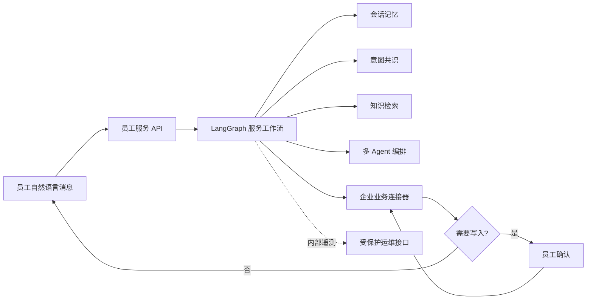

# 企业员工智能客服平台

面向制造企业内部员工的自然语言服务入口。员工无需选择业务菜单，直接描述工艺规范、考勤制度、设备故障或流程申请，系统在后台完成意图判断、知识检索、业务查询与服务编排；涉及写入的操作会在提交前展示业务确认卡。

## 核心能力

- **自然语言统一入口**：三路意图共识自动理解员工诉求，低置信度时主动追问。
- **多 Agent 服务编排**：综合服务、设备技术、制度政策、流程协同和人工协同能力按健康度动态路由，故障时自动降级。
- **企业知识问答**：查询改写、混合召回、重排、缓存和超时熔断，回答可携带资料依据。
- **受控业务办理**：LangGraph 持久化状态；报修与流程申请先确认、后执行，并通过幂等键避免重复提交。
- **企业系统适配**：统一连接器协议接入 HR、EAM/MES 与 OA/BPM，支持本地参考实现和企业 HTTP 实现无缝切换。
- **运行可观测**：公开员工响应不包含内部判断；授权运维人员可查看请求追踪、模型通道、路由健康和 Prometheus 指标。

## 系统边界



员工端只接收答案、引用资料、业务确认和办理回执。意图类别、候选 Agent、路由原因、检索分数与模型通道仅保存在内部追踪中。

## 技术栈

Python 3.12 · FastAPI · LangGraph · Redis · ChromaDB · Prometheus · Vue 3 · Vite · Docker Compose

## 快速启动

### Docker Compose

```bash
cp .env.example .env
docker compose up --build
```

- API：`http://localhost:8000`
- OpenAPI：`http://localhost:8000/docs`
- ChromaDB：`http://localhost:8001`
- Grafana：`http://localhost:3000`

### 本地开发

```bash
python -m venv .venv
source .venv/bin/activate
pip install -r requirements.txt
cp .env.example .env
uvicorn api.main:app --reload --port 8000
```

Windows PowerShell 使用 `.\.venv\Scripts\Activate.ps1` 激活环境。未配置外部模型或企业系统地址时，服务使用本地连续性模型和参考业务实现；它们遵循与生产连接器相同的接口契约，便于离线开发和集成验证。

## API 分层

| 范围 | 方法与路径 | 用途 |
| --- | --- | --- |
| 员工端 | `POST /chat` | 自然语言咨询与受理 |
| 员工端 | `POST /requests/{request_id}/confirm` | 确认或取消待提交事项 |
| 公共探针 | `GET /health` | 仅返回服务可用状态 |
| 运维端 | `GET /admin/status` | Agent、模型与检查点状态 |
| 运维端 | `GET /admin/traces/{request_id}` | 单次请求内部执行追踪 |
| 运维端 | `GET /monitor` | 运行监控摘要 |
| 运维端 | `GET /metrics` | Prometheus 指标 |
| 管理端 | `POST /knowledge/add` | 导入知识文档 |
| 质量端 | `POST /eval/run` | 执行回归评测 |

### 自然语言咨询

```bash
curl -X POST http://localhost:8000/chat \
  -H "Content-Type: application/json" \
  -d '{"user_id":"E1001","message":"设备 EQ-A17 出现 E104 故障，请帮我提交报修"}'
```

当响应状态为 `confirmation_required` 时，员工确认提交：

```bash
curl -X POST http://localhost:8000/requests/REQUEST_ID/confirm \
  -H "Content-Type: application/json" \
  -d '{"action":"confirm"}'
```

员工端响应固定为 `request_id`、`conversation_id`、`answer`、`status`、`sources`、`confirmation` 和 `receipt`，不暴露内部编排字段。

## 企业系统接入

设置 `ENTERPRISE_API_BASE_URL` 与 `ENTERPRISE_API_TOKEN` 后，业务连接器切换到企业 HTTP 通道。下游服务实现 `/v1/queries`、`/v1/actions` 和 `/v1/tasks/query`；完整字段见 [企业 API 契约](docs/api-contracts.md)。

## 质量验证

```bash
pytest
python -m evaluation.evaluator
```

仓库包含 55 条制造业务意图回归数据，CI 准确率门槛为 92%。正式上线前应使用目标模型与经过授权的企业数据重新生成质量报告。

## 安全与发布

- `APP_API_KEY` 保护应用 API，`ADMIN_API_KEY` 单独保护内部状态与追踪。
- 密钥只从环境变量读取；`.env`、运行数据、日志和本地资料不进入版本库。
- 业务写操作经用户确认并记录审计事件，下游调用携带幂等键。
- 生产环境建议由 API Gateway 接入企业 SSO、RBAC、TLS 和集中审计归档。

## 文档

- [架构设计](docs/architecture.md)
- [企业 API 契约](docs/api-contracts.md)
- [评测方法](docs/evaluation.md)
- [本地产品体验](docs/local-experience.md)

## License

MIT
